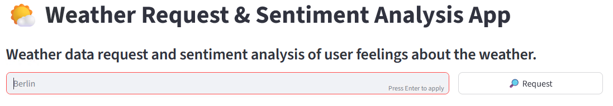
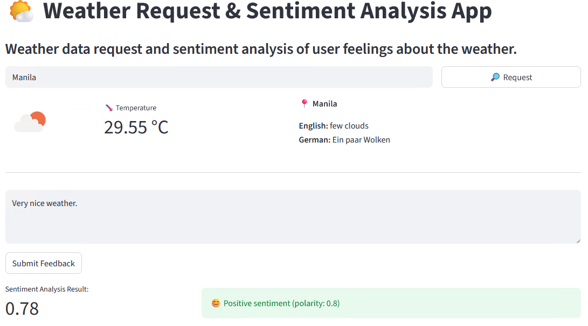

# Weather-Sentiment-Analysis

--- 
## Project Description

---
An end-to-end weather + sentiment tracking app with a Streamlit UI and FastAPI backend. Integrated OpenWeatherMap API, TextBlob sentiment scoring, SQLite/Supabase persistence, centralized logging, and Discord webhook alerts on new entries.

## Project Objective

---
1. **Interactive UI:** A Streamlit frontend to visualize and interact with the data. It allows requests for weather data based on a City name. The User can then express their sentiment about the weather with free text which will be analyzed using sentiment analysis.
2. **Multiple_use FastAPI backend:** The FastAPI backend stores the data in a SQLite database and Supabase database and exposes an endpoint to retrieve the data. Weather data is retrieved from www.openweathermap.org using the OpenWeatherMap API. The sentiment analysis is performed using the TextBlob library.
3. **Centralized Logging:** All logs are written to two centralized logging files: one for the frontend app and one for the backend app.
4. **Discord Webhook:** The backend sends a Discord webhook notification whenever a new request has been made through the UI and a record is added to the database.
5. **Data in GUI display and storage:** The following data is stored in a SQLite database and a Supabase database and displayed in the frontend:
   - City Name
   - Temperature (in degrees Celsius)
   - Weather Description in English
   - Weather Description in German
   - Sentiment input (Free Text)
   - Sentiment Analysis Result (Mean Polarity)
   - Timestamp


## File Structure

---
```text
Annika_Abschlussprojekt/
├── backend/
│   ├── app.py                          # FastAPI Service (Port 8000)
│   ├── app.log                         # Centralized backend logging file
│   ├── cloud_db.py                     # Supabase Database Handler class
│   ├── config.py                       # Configuration file
│   ├── sentiment_analysis.py           # Sentiment Analysis Class
│   ├── sqlitedb.py                     # SQLite Database Engine Handler
│   └── weather_fetchers.py             # Weather Fetcher Classes
├── config/
│   └── config.json                     # Configuration file
├── data/
│   └── output_data/    
│        └── weather_sentiment_data.db  # SQLite Database
├── frontend/
│   ├── app.log                         # Centralized frontend logging file
│   └── app.py                          # Streamlit UI (Port 8501)
├── logging/
│   └── logging.ini                     # Centralized logging configuration
├── .env                                # Environment variables (Discord Webhook)
├── .gitignore                          # Files excluded from Version Control
├── requirements.txt                    # Project dependencies
└── README.md                           # Project documentation
```

## Setup Instructions

---
1. **Clone Repo**
~~~
git clone https://github.com/FiveDot-tec/Annika_Abschlussprojekt
~~~
2. **Environment Configuration**
Create a .env file in the root directory. It should contain the following:
~~~
OWM_API_KEY="Your OpenWeatherMap API Key"
WEB_HOOK="Your Discord Webhook URL"
SUPABASE_URL="Your Supabase URL"
SUPABASE_SERVICE_ROLE_KEY="Your Supabase Anonymous Key"
~~~
3. **Logging Path**
The centralized ***logging/logging.ini*** configuration is utilized by both the frontend and backend. 
Ensure you run your scripts from the project root or verify that the paths in your scripts point correctly to the logging/ directory to avoid FileNotFound errors.


4. **Install Dependencies**
~~~bash
pip install -r requirements.txt
~~~


## Running the Project

---
You must open two separate terminal windows simultaneously to run this project. 
Change the directory to the project root directory before starting each process.

### Step 1: Start the FastAPI Backend from the project root
~~~bash 
fastapi dev backend/app.py --reload --port 8000
~~~
Make sure to include the `--server.port` flag to avoid port conflicts.
Run the command in the project root directory.
Verify the backend is live at **127.0.0.1**


### Step 2: Start the Streamlit Frontend in a new terminal window
~~~bash 
streamlit run frontend/app.py --server.port 8501
~~~
Make sure to include the `--server.port` flag to avoid port conflicts.
Run the command in the project root directory.
Access the GUI at http://127.0.0.1:8501


## Web UI
Start Page:

## Web UI
Start Page:


1. Type in a city name and press the Request Button.
2. The weather data for the selected city will be displayed.
3. Enter your sentiment and press the Submit Feedback Button.
4. The sentiment analysis result will be displayed.

Result Page:

